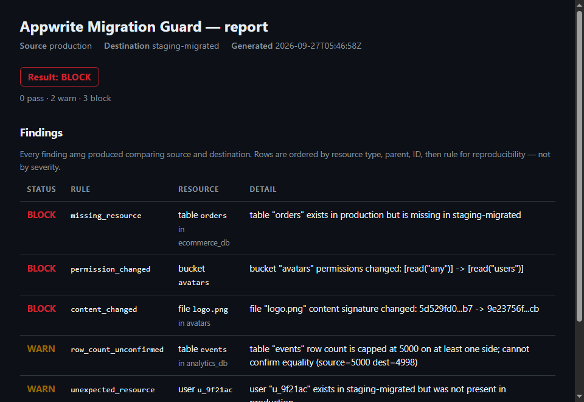

# Appwrite Migration Guard (amg)

[](https://github.com/sailwalpranjal/appwrite-migration-guard/actions/workflows/ci.yml)
[](https://goreportcard.com/report/github.com/sailwalpranjal/appwrite-migration-guard)
[](https://pkg.go.dev/github.com/sailwalpranjal/appwrite-migration-guard)
[](LICENSE)

**Verify Appwrite changes before they become incidents.**

> **Status: pre-alpha, but every command is real and live-verified.**
> All 8 commands work end to end against a live Appwrite Cloud project —
> every resource type from the original spec (TablesDB, Storage, Users,
> Functions, Sites) is inventoried and compared, with a documented,
> tested boundary on what's deliberately never collected (passwords,
> emails, function/site environment variables — see
> [Limitations](#limitations)). Nine separate live-verification passes
> are logged under [Testing](#testing), each introducing a real change
> and confirming amg caught it. This README describes what exists today
> — see [Roadmap](#roadmap) for what's still open.

## The problem

Appwrite already provides migration tooling, and its own documentation
recommends validating permissions and data integrity after a migration or
self-hosted upgrade — because migrations can produce partial transfers,
permission drift, or silently-skipped resources. Most teams currently
validate this by hand, or not at all, and only discover a problem once an
application starts failing in production.

## What amg is

An independent, local-first CLI that:

- inventories resources in an Appwrite project (source and/or destination),
- builds a deterministic manifest of that inventory,
- applies documented compatibility/normalization rules to tell real
  differences apart from expected migration transformations,
- compares source, expected, and destination state,
- reports the result as **PASS / WARN / BLOCK** — never a fabricated
  numeric "safety score" — with an explicit reason for every failure.

## What amg is not

- Not a migration engine. It never moves or writes data in your Appwrite
  projects — it only reads, for inventory and verification.
- Not an Appwrite clone, BaaS, or admin-console replacement.
- Not a hosted SaaS, dashboard, or multi-tenant service.
- Not AI/ML-based. There is no model, no LLM, no generated analysis —
  every check is an explicit, documented rule.

### Product boundary

A few things amg deliberately does not do, because they fall outside
"verify Appwrite resource state matches" into a different, larger
product: relationship-integrity verification across resources (that a
relationship column's referenced rows still exist), runtime probes of
function/site behavior (as opposed to their config), application-level
invariant checking (anything specific to what *your* app means by its
data), policy-as-code or approval workflows, and backup/rollback
verification. Each of these would require either executing your
application's own logic or encoding assumptions about it that amg has no
way to verify generically — building them in would turn amg into a
different, much larger product (a generic data-integrity/monitoring
platform) with a correspondingly larger surface to get wrong. See
[docs/comparison-model.md](docs/comparison-model.md#what-this-does-not-do)
for the precise, current list of what *is* and isn't compared.

## Supported Appwrite environments

- **Appwrite Cloud**, when `APPWRITE_ENDPOINT`/`AMG_*_ENDPOINT` points at
  `https://cloud.appwrite.io/v1` (or your region's endpoint) with a valid
  project ID and API key.
- **Self-hosted Appwrite**, when pointed at your own endpoint.

REST endpoints and request/response shapes used by amg are verified
against the [appwrite/appwrite](https://github.com/appwrite/appwrite)
server source at tag `2.3.0` (see comments in `internal/appwrite`), not
guessed. If you run a materially older self-hosted version and hit a
mismatch, please open an issue.

## Installation

Requires [Go 1.21+](https://go.dev/dl/).

```bash
git clone https://github.com/sailwalpranjal/appwrite-migration-guard
cd appwrite-migration-guard
go build -o amg ./cmd/amg
```

Release automation (`.goreleaser.yaml`, `.github/workflows/release.yml`,
[GoReleaser](https://goreleaser.com)) is in place to build Linux/macOS/
Windows binaries (amd64 + arm64, minus Windows/arm64) on every `vX.Y.Z`
tag — validated locally with `goreleaser build --snapshot` and
`goreleaser release --snapshot --skip=publish` (all 5 targets build,
archive, and the resulting binary runs and reports the correct injected
version). No tag has been pushed yet, though — until the first release,
building from source is the only option.

## Quick start

```bash
cp .env.example .env
# edit .env with your Appwrite endpoint/project/API key

./amg doctor
```

`doctor` checks, in order: that required environment variables are set,
that the endpoint is reachable (`GET /health/version`, unauthenticated),
and that the configured API key is valid and has the `health.read` scope
(`GET /health`). It never mutates anything.

```bash
./amg inventory
```

`inventory` lists every TablesDB database/table (plus a per-table row
count) and every Storage bucket/file (including each file's MD5 content
signature) in the configured project. Add `--json` for machine-readable
output, `--no-row-counts` to skip row counts, `--sample-rows N` to also
fingerprint the first N rows per table for content verification (off by
default — this reads real row data, unlike counts), or `--concurrency N`
to change how many Appwrite requests run at once (default 4). It never
writes to your project and never downloads file content; sampled row
content is hashed and discarded immediately, never stored or transmitted.

```bash
./amg snapshot --label source --out source.json
# ... time passes, a migration happens, or the environment changes ...
./amg snapshot --label destination --out destination.json

./amg compare source.json destination.json
```

`snapshot` runs the same inventory as `amg inventory` and persists it as a
manifest (default: `.amg/runs/<run-id>/manifest.json`). `compare` then
diffs two manifests **fully offline** — no Appwrite credentials needed —
and prints exactly what changed, classified PASS/WARN/BLOCK. See
[docs/comparison-model.md](docs/comparison-model.md) for every rule.

```bash
./amg verify
```

`verify` does the same comparison live: it inventories `AMG_SOURCE_*` and
`AMG_DEST_*` concurrently, then runs the identical offline comparison
engine `compare` uses. It answers "does the destination match the source
on everything amg checks" — resource existence, permissions, config,
table schema, and (if enabled) row/file content — not "is this migration
correct end to end"; see [docs/comparison-model.md](docs/comparison-model.md#what-this-does-not-do)
for what's deliberately outside that check, on every result including PASS.

```bash
./amg preflight
```

`preflight` runs *before* a migration: connectivity, authentication, and
Appwrite version on both `AMG_SOURCE_*` and `AMG_DEST_*`, then inventories
both sides and checks whether the destination already has a resource with
the same ID as something in the source — a real collision risk, not a
"looks the same" success the way `verify` treats it. Answers "can I safely
proceed, or are there unresolved risks?"

```bash
./amg verify --json > result.json
./amg report --format html --out report.html result.json
```

`report` re-renders a `compare`/`verify` result you already saved as
`--json` — as `text` (default), `json` (pretty-printed), or a
self-contained `html` file with no external stylesheet, script, or
network request of any kind, safe to open straight from disk or attach
to a PR/ticket. Every value is HTML-escaped (a resource literally named
`<script>...</script>` renders as inert text, not executes), and
PASS/WARN/BLOCK is always shown as text, never color alone. `report`
makes no network calls and needs no Appwrite credentials — it only reads
the JSON file you give it.

## Configuration

amg reads configuration from environment variables (and an optional local
`.env` file, which never overrides a real environment variable). See
[.env.example](.env.example) for the full list:

- `APPWRITE_ENDPOINT` / `APPWRITE_PROJECT_ID` / `APPWRITE_API_KEY` — a
  single target environment, used by commands that operate on one project
  (`inventory`, `snapshot`, `doctor`).
- `AMG_SOURCE_*` / `AMG_DEST_*` — a source/destination pair, used by
  commands that compare two environments (`preflight`, `verify`).

API keys are never logged, never written to manifests or reports, and are
only ever sent as the `X-Appwrite-Key` HTTP header.

## Example workflow

```text
amg doctor                                          # confirm connectivity + auth
amg preflight                                       # check readiness before migrating
# ... you run the Appwrite migration or upgrade yourself ...
amg verify --json > result.json                     # compare source and destination live
amg report --format html --out report.html result.json

# or, fully offline, from saved manifests:
amg snapshot --label source --out source.json       # before the migration
amg snapshot --label destination --out dest.json    # after the migration
amg compare --json source.json dest.json > result.json
amg report --format html --out report.html result.json
```

## Example report

Real terminal output from the live-testing session described under
[Testing](#testing) below (`amg compare` on two manifests captured
minutes apart, after deliberately changing a table's permissions and
`rowSecurity` flag):

```text
Appwrite Migration Guard — compare

Source:      source
Destination: destination

BLOCK [config_changed] table "widgets" metadata "row_security" changed: false -> true
BLOCK [permission_changed] table "widgets" permissions changed: [read("any")] -> [read("users")]

Result: BLOCK
```

The same result rendered with `amg report --format html` produces a
static page with a PASS/WARN/BLOCK badge, a findings table, and no
external dependencies — safe to open offline or attach to a PR:



*Illustrative example with synthetic project/resource names (`production`,
`staging-migrated`, `orders`, `avatars`) — real `amg compare`/`report`
output, not a mockup, generated the same way the [Testing](#testing)
section's live-verification runs were.*

## Architecture

```text
cmd/amg/            CLI entrypoint (argument parsing, dispatch)
internal/cli/       Subcommand implementations, PASS/WARN/BLOCK reporting
internal/appwrite/   Minimal Appwrite REST client (auth, retries, pagination, TablesDB)
internal/inventory/  Canonical resource model + bounded-concurrency collector
internal/manifest/   Deterministic on-disk snapshot format (no credentials, ever)
internal/compare/    Offline PASS/WARN/BLOCK comparison engine
internal/report/     Self-contained HTML report renderer (no external resources)
internal/config/     Environment-variable configuration loading
internal/errs/       Typed error taxonomy (connectivity/auth/rate-limit/...)
internal/version/    Build-time version metadata
```

No database, no message broker, no background services. Comparison is
designed to run from local JSON manifests so it works fully offline (see
[docs/comparison-model.md](docs/comparison-model.md), to be written
alongside the comparison engine).

## Comparison semantics

Every check resolves to exactly one of:

- **PASS** — verified and matches expectations (including documented,
  expected migration transformations).
- **WARN** — verified only partially (e.g. a row count hit Appwrite's
  5,000 cap, or amg couldn't verify one side), or a resource type is not
  yet supported by amg.
- **BLOCK** — a real, unexplained difference, or amg could not complete
  verification at all. An incomplete run is always BLOCK, never a silent
  pass.

Full rule table: [docs/comparison-model.md](docs/comparison-model.md).

## Security

- No secrets are ever written to logs, manifests, JSON reports, or HTML
  reports.
- API keys are sent only as request headers, never as query parameters or
  in request/response bodies that get persisted.
- See [SECURITY.md](SECURITY.md) for the reporting process.

## Testing

```bash
go build ./...
go vet ./...
go test ./...
```

All claims of "supported" or "tested" in this repository are backed by the
tests in the corresponding package — see `*_test.go` files next to the
code they test. Beyond mocked-HTTP tests, amg's core loop has been run
nine times against a live Appwrite Cloud project. TablesDB: create a
database + table, snapshot it as "source", change its permissions and a
config flag, snapshot again as "destination", `amg compare` the two
manifests (correctly reported both changes and nothing else), delete the
table entirely and confirm `missing_resource` fires, then run `amg
verify` live against the same project as both source and destination
(correctly reported PASS). Storage: create a bucket + upload a file,
snapshot as "source", delete and re-upload the same file ID with
different content, snapshot as "destination", `amg compare` correctly
reported `content_changed` with the exact before/after MD5 signatures —
without amg ever downloading the file. Preflight: created a database,
pointed `AMG_SOURCE_*`/`AMG_DEST_*` at the same project, and confirmed
`amg preflight` correctly reported a `Destination conflict` BLOCK for the
already-existing database ID; also confirmed it reports the specific "API
key was rejected" reason (not a generic error) when given bad
credentials. Row sampling: created a table with two rows, snapshotted
with `--sample-rows 10` as "source", edited one row's content, snapshotted
again as "destination" — `amg compare` correctly reported
`row_content_changed` naming the changed row and its before/after
digests, with the unchanged row and both rows' `$updatedAt` drift
correctly producing no finding. Reporting: piped a real `amg compare
--json` result (a permission + config change on a live table) through
`amg report --format html` and inspected the output file directly — a
complete, valid HTML document with both findings rendered, auto-escaped,
and no external resource references. Users: created a real user (whose
raw Appwrite response, confirmed by inspecting it directly, included a
live argon2 password hash and email address), ran `amg inventory --json`
and grepped the output for the hash/email/phone — zero matches, confirmed
absent from both the JSON and the saved manifest file. Disabled the user
and added a label, snapshotted again, and `amg compare` correctly
reported both changes (`enabled`, `labels`) with no PII anywhere in
either manifest. Functions: created a real function (whose raw Appwrite
response included an explicit `"vars":[]` field, confirming the shape
amg's exclusion is designed against), snapshotted as "source", changed
its schedule and execute permissions, snapshotted as "destination" —
`amg compare` correctly reported both changes, and grepping both
manifests for `vars`/secret-shaped strings found nothing. Sites: created
a real site, snapshotted, changed its logging flag/build command/output
directory, snapshotted again — `amg compare` correctly reported all
three changes with no `vars` leakage. Legacy Databases: created a
database via `POST /v1/tablesdb`, fetched it via `GET /v1/databases`
(the legacy list endpoint) and confirmed the response was byte-for-byte
identical — proving amg needs no separate legacy collector, not just
inferring it from source. All test resources were deleted afterward.

## Migration lab

```bash
go test ./lab/...
```

`lab/` is a deterministic, credential-free fault-injection suite: 8
scenarios, run through the real client/pagination/retry/collection/
comparison stack against `httptest` servers (not mocked-out internals),
proving amg actually detects the problems it claims to:

| Scenario | Proves |
|---|---|
| A — destination missing a table | `missing_resource` → BLOCK |
| B — destination missing a file | `missing_resource` → BLOCK |
| C — permission changed | `permission_changed` → BLOCK |
| D — timestamps differ after "migration" | expected transformation → PASS, no finding |
| E — transient API failure | retried automatically, run still succeeds |
| F — persistent API failure | `Collect` returns an error, never a silent partial success |
| G — interrupted run (context deadline) | `inventory.Collect` **and** `amg doctor` both error out, never exit OK |

This is deliberately synthetic, fixture-driven data — unlike the rest of
amg's development, which was proven against a live Appwrite Cloud
project at every stage (see [Testing](#testing) and `CHANGELOG.md`). The
lab's purpose is the opposite: repeatable, CI-runnable, credential-free
regression coverage for specific edge cases. Both kinds of evidence are
real; they answer different questions. This suite also runs in CI on
every push (`.github/workflows/ci.yml`).

## Limitations

- Pre-alpha: every command (`version`, `doctor`, `inventory`, `snapshot`,
  `compare`, `verify`, `preflight`, `report`) does real work now against a
  live Appwrite project. What's still missing is listed item by item
  below and in [Roadmap](#roadmap) — some are resource-coverage gaps,
  some are depth gaps (e.g. table schema/column/index drift, closed in
  this stage); treat this list, not a summary phrase, as the source of
  truth for what amg does and doesn't check.
- `preflight`'s "destination conflict" check is ID-based only: it flags a
  resource ID that already exists on the destination, but cannot tell you
  *why* it's there or whether that's actually a problem for your specific
  migration.
- Inventory (and therefore comparison) covers TablesDB
  (databases/tables/row counts), Storage (buckets/files), Users,
  Functions, and Sites — every resource type from the original spec.
  Legacy Databases (collections/documents) needed no separate collector:
  see [docs/migration-semantics.md](docs/migration-semantics.md) for the
  live + source-code verification, including one caveat that wasn't
  reproduced live (a scope limitation, not a data-shape doubt).
- Function and Site comparison is config-only (runtime/framework,
  schedule, timeout, build commands, ...) — amg has no way to know
  whether the actual *code* behaves the same after a migration, only
  whether configuration matches. Environment variables (`vars`) are
  never collected at all for either: Appwrite's own model documents them
  as routinely holding secrets, and neither `appwrite.Function` nor
  `appwrite.Site` has a field for them to decode into.
- User inventory is deliberately narrow: only administrative/verification
  state (enabled/disabled, email/phone verification flags, MFA, labels).
  amg never collects or compares a user's email, phone number, or prefs
  (personally identifiable/arbitrary application data), and the API
  response's password/hash/hashOptions fields are never even decoded —
  there is no Go struct field for them to land in. See
  [docs/migration-semantics.md](docs/migration-semantics.md).
- Row content comparison for TablesDB is opt-in and sampled, not
  exhaustive: `--sample-rows N` fingerprints the first N rows per table
  (by `$id`) and catches real content/permission changes *within* that
  sample, but a changed row outside the sampled window is invisible to
  it. It is off by default because — unlike counts — it reads real row
  data. See [docs/comparison-model.md](docs/comparison-model.md).
- Row counts above 5,000 are capped by Appwrite itself; amg reports this
  as `row_count_unconfirmed` (WARN), never as a false match.
- Only one normalization/"expected transformation" rule exists so far
  ($createdAt/$updatedAt are never compared — see
  [docs/comparison-model.md](docs/comparison-model.md)). Real migration
  paths may have more expected transformations amg doesn't know about yet.
- Not tested against every self-hosted Appwrite version — verified so far
  against Appwrite Cloud running server version 2.3.0.
- `amg report`'s HTML output covers `compare`/`verify` results only — it
  does not (yet) render `doctor`/`preflight`'s checklist output.
- Windows/macOS/Linux binaries are not yet published; build from source.

## Roadmap

1. ~~Inventory: TablesDB (tables/rows)~~ — done.
2. ~~Deterministic manifest format + `amg snapshot`~~ — done.
3. ~~Normalization + comparison engine + `amg compare` (fully offline)~~ — done.
4. ~~`amg verify` wired to the comparison engine~~ — done.
   ~~`amg preflight` (pre-migration risk checks)~~ — done.
5. ~~Inventory + comparison for Storage (buckets/files, MD5 content
   verification)~~ — done. ~~Opt-in TablesDB row content verification
   (`--sample-rows`, addressing the "counts only" limitation)~~ — done.
   ~~Users inventory (administrative state only)~~ — done. ~~Functions
   inventory (config only, never env vars)~~ — done. ~~Sites inventory
   (config only, never env vars)~~ — done. ~~Legacy Databases
   (collections/documents)~~ — confirmed to need no separate collector
   (see docs/migration-semantics.md). Every original-spec resource type
   is now inventoried.
6. ~~Static HTML reporting (`amg report`)~~ — done, alongside JSON/text.
7. ~~Fault-injection migration lab + CI~~ — done (`lab/`, runs in CI on
   every push, `gofmt`/`go vet`/`go test -race`/`go build`).
8. ~~Cross-platform release binaries~~ — automation done and locally
   validated; no tag pushed yet, so no release exists on GitHub yet.

## Contributing

See [CONTRIBUTING.md](CONTRIBUTING.md). Issues and PRs welcome; please
open an issue before large changes.

## License

[MIT](LICENSE)
